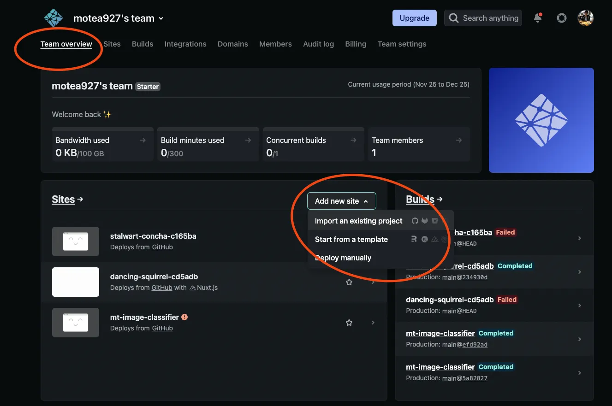

之前的 side project 我幾乎都是架在 gcp 或 heroku，因為 netlify 只能架設靜態網頁，實在無法滿足我的需求，但近期得知 netlify 可以很好的架設 Nuxt 3 後，嘗試看看把使用 Nuxt 3 撰寫的部落格架設到 netlify，而且幾乎是 zero config，非常的方便！！

## 在 netlify 快速部屬 Nuxt3 專案

1. 在 [netlify](https://www.netlify.com/) 註冊及登入
2. Team overview -> Add new site -> import an existing project

   

3. 連接 github
4. 選擇專案

基本上 `Nuxt3` 的專案不用特別設定就可以直接部屬成功在 [netlify](https://www.netlify.com/)，非常友善及節省時間

## 網域設定

網域是搭配很久之前從 [gandi](https://www.gandi.net/zh-Hant) 購買的網域

1. 在 Site settings 內找到 Domain management，點擊 `Add custom domain`
2. `netlify` 會提醒這個網域已被註冊，此時不用擔心，點選 `Add domain`
3. 對著新增的 `domain` 點選 `Options`， Set up Netlify DNS
4. 會得到四個 `domain’s name`，前往 gandi 進行設定
5. 在 gandi 點選 域名 -> 名稱伺服器 -> 變更 -> 外部，把剛剛得到的四個 domain 輸入進去
6. 回到 netlify 點選 done，並等待五分鐘進入我們購買的[網域](https://morty.tw/)看有沒有成功
7. 成功後在 `netlify` 點選 `Verify DNS configuration`，若通過大概等十分鐘就有自動轉 https 了
