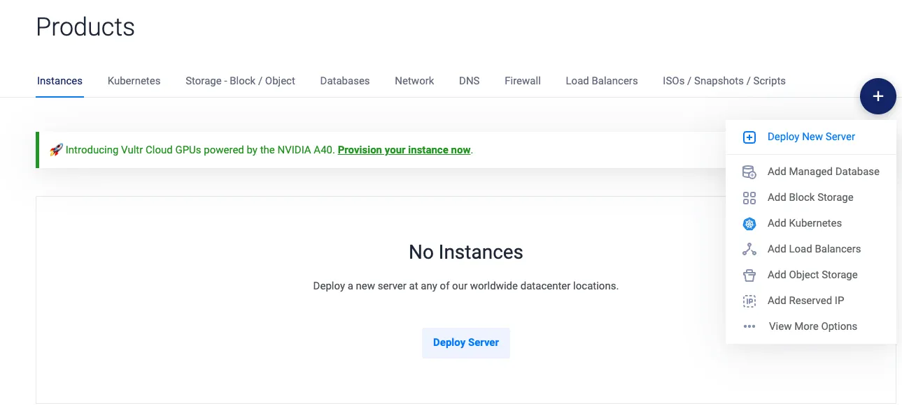

本文詳細介紹如何將 NestJS + PostgreSQL 的 side project 從 GCP 移至 VPS 虛擬主機 - Vultr，並探討 Docker 的使用和部署策略。從 Dockerizing 專案、網域設定，到在 Vultr VPS 上的部署步驟，提供完整的指南和參考資源，助您輕鬆完成部署。

## 原由

最近寫了一個 `NestJS` + `PostgreSQL` 的 `side project`，原先使用 GCP 上的 [Cloud Run](https://cloud.google.com/run?hl=zh-tw) + [Cloud SQL](https://cloud.google.com/sql?hl=zh-tw)，但後來發現 [Cloud SQL](https://cloud.google.com/sql?hl=zh-tw) 的計價是以小時的，不是像其他 App Engine 等服務是照用量計價，導致我才開一兩天價格就爆表，因此最終決定將專案移至 VPS 虛擬主機上，經比較及調查最終決定使用 [Vultr](https://www.vultr.com/)，一個月只要 6 美金就很夠用。

## Dockerizing 專案

1. 新增 `.dockerignore` 檔案

```dockerfile
# Git
.git
.gitignore

# Docker
.docker
Dockerfile
.dockerignore

# Node
node_modules
npm-debug.log
dist
.env.*
```

2. 新增 `Dockerfile`

```dockerfile
FROM node:lts-alpine
# Create app directory
WORKDIR /app
EXPOSE 3000


# A wildcard is used to ensure both package.json AND package-lock.json are copied
COPY package.json ./
COPY pnpm-lock.yaml ./

# Install app dependencies
RUN npm i -g pnpm
RUN pnpm install

# Bundle app source
COPY . .

# Creates a "dist" folder with the production build
RUN pnpm run build
```

3. 新增 `docker-compose.yml`
   裡面有多個容器， 以下簡易說明

- app 為我們的 NestJS 服務，因專案使用 googl 登入 故有 `GOOGLE_CLIENT_ID` 等環境變數
- db 為 postgres 資料庫服務
- dbGUI 為 pgadmin 的 web 介面，詳細可參考 [pgadmin-Container Deployment](https://www.pgadmin.org/docs/pgadmin4/latest/container_deployment.html#environment-variables)
- nginx 主要進行反向代理及 https 相關設定，使用 [docker-nginx-certbot](https://github.com/JonasAlfredsson/docker-nginx-certbot) 自動申請證書

需要注意的是 環境變數相關建議使用 `env_file`，避免在 git 上留下任何紀錄，此文章方便紀錄先將大部分環境變數寫在 `environment`。

此外，透過 volumes 可以持久化我們的 db 數據及 證書。

```dockerfile
version: '3.9'

services:
  app:
    build:
      context: .
    restart: always
    ports:
      - 3000:3000
    volumes:
      - ./src:/app/src
    command: >
      sh -c "pnpm run start:prod"
    environment:
      - DB_HOST=your_host
      - DB_NAME=your_db_name
      - DB_USERNAME=your_user_name
      - DB_PASSWORD=your_db_password
      - GOOGLE_CLIENT_ID=your_google_client_id
      - GOOGLE_CLIENT_SECRET=your_google_client_secret
    depends_on:
      - db

  db:
    image: postgres:13-alpine
    restart: always
    volumes:
      - dev-db-data:/var/lib/postgresql/data
    environment:
      - POSTGRES_DB=your_db_name
      - POSTGRES_USER=your_user_name
      - POSTGRES_PASSWORD=your_db_password

  dbGUI:
    container_name: 'pgadmin'
    image: dpage/pgadmin4
    restart: always
    environment:
      PGADMIN_DEFAULT_EMAIL: your_email
      PGADMIN_DEFAULT_PASSWORD: your_password
      PGADMIN_LISTEN_PORT: 16543
    ports:
      - '16543:16543'
    depends_on:
      - db

  nginx:
    image: jonasal/nginx-certbot:latest
    restart: unless-stopped
    env_file:
      - ./nginx-certbot.env
    ports:
      - 80:80
      - 443:443
    links:
      - app
      - dbGUI
    volumes:
      - nginx_secrets:/etc/letsencrypt
      - ./user_conf.d:/etc/nginx/user_conf.d

volumes:
  dev-db-data:
  nginx_secrets:

```

4. 新增 user_conf.d/example_server.conf
   由於要搭配 [docker-nginx-certbot](https://github.com/JonasAlfredsson/docker-nginx-certbot) 申請證書，需要新增 `user_conf.d` 資料夾及 `example_server.conf` 檔案，需將以下內容的 `yourdomain.example` 替換成自己的 domain，透過反向代理將後端 api 及 pgadmin 導至正確的 port，需要注意 `upstream` 內的 `app` 及 `dbGUI` 在 `docker-compose.yml` 中的 `nginx` `links` 內進行設定，其餘就依照需求進行 nginx 的設定

```
upstream backend {
    server app:3000;
}

upstream dbGUI {
    server dbGUI:16543;
}

server {
    # Listen to port 443 on both IPv4 and IPv6.
    listen 443 ssl default_server reuseport;
    listen [::]:443 ssl default_server reuseport;

    # Domain names this server should respond to.
    server_name yourdomain.example;

    # Load the certificate files.
    ssl_certificate         /etc/letsencrypt/live/yourdomain.example/fullchain.pem;
    ssl_certificate_key     /etc/letsencrypt/live/yourdomain.example/privkey.pem;
    ssl_trusted_certificate /etc/letsencrypt/live/yourdomain.example/chain.pem;

    # Load the Diffie-Hellman parameter.
    ssl_dhparam /etc/letsencrypt/dhparams/dhparam.pem;

    location ^~ /admin/ {
        proxy_set_header X-Script-Name /admin;
        proxy_set_header Host $host;
        proxy_pass http://dbGUI/;
        proxy_redirect off;
    }

    location / {
        proxy_pass http://backend/;
    }
}

```

## 申請及設定 Vultr VPS

1. 註冊 [Vultr](https://www.vultr.com/) 帳號
2. 右上角點選藍色 + -> Deploy New Server
   
3. 選擇 Cloud Compute 類型，其餘設定依據需求，這邊主機位置選擇 `Singapore` 或 `Tokyo` 都差不多，依據個人測試為主
4. 完成之後透過 ssh 連進主機，可在專案 `Overview` 上看到 ip 及密碼

```bash
ssh root@yourip
```

5. 連進後進行防火牆設定

```bash
sudo ufw reset
sudo ufw allow ssh
sudo ufw allow 80
sudo ufw allow 443
sudo ufw enable
```

6. 參考 [docker-install](https://docs.docker.com/engine/install/ubuntu/#install-using-the-repository) 安裝 docker

7. 在 Github 中的 Settings -> Deploy keys 新增 ssh key (方便主機 pull 專案)
8. 在主機中 clone 專案並執行

```bash
git clone your_repo
cd your_repo
docker compose up -d
```

基本步驟就差不多完成了，之後就可以把相關流程寫進 Actions，方便快速部屬

## 參考文件

- [Vultr](https://www.vultr.com/)
- [Using Docker to containerize your Node.js application and serve it over HTTPS in the AWS Elastic Beanstalk](https://efraim-rodrigues.medium.com/using-docker-to-containerize-your-node-js-aefcd1ecd37d)
- [Install Docker Engin on Ubuntu](https://docs.docker.com/engine/install/ubuntu/#install-using-the-repository)
- [pgadmin-Container Deployment](https://www.pgadmin.org/docs/pgadmin4/latest/container_deployment.html)
- [利用 Docker 五分鐘內完成設定 Nginx 及 Let's Encrypt SSL 憑證](https://www.rickjiang.dev/blog/nginx-and-lets-encrypt-with-docker)
- [How to write a NestJS Dockerfile optimized for production](https://www.tomray.dev/nestjs-docker-production)
- [How to Install and Configure Nginx on a Vultr Cloud Server](https://www.vultr.com/docs/how-to-install-and-configure-nginx-on-a-vultr-cloud-server/)
